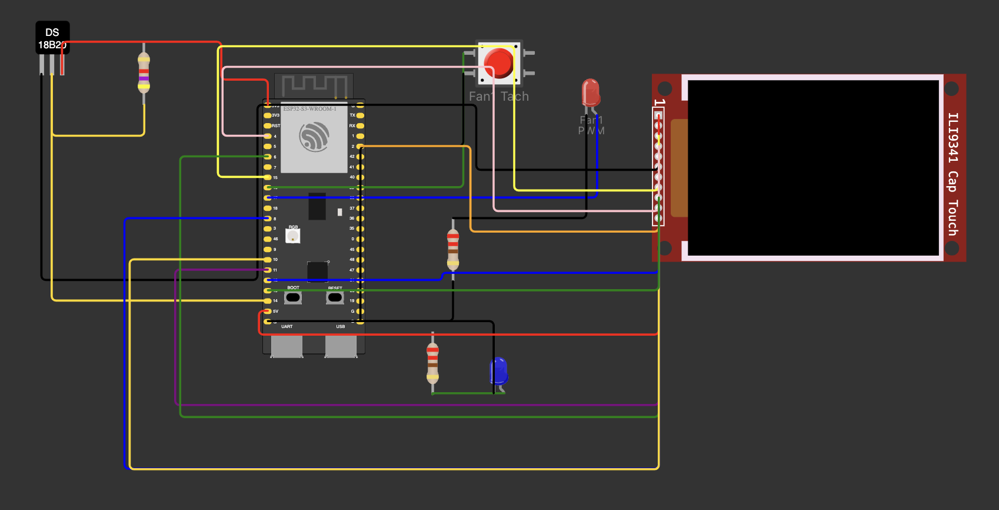

# ESP32 Smart Fan Controller

A fan controller system built with ESP32, featuring temperature-based control, MQTT integration, and a TFT display interface. (including a wokwi simulation)

[](./assets/wokwi-screenshot.png)

## Features

- Temperature-based automatic fan speed control
- Manual and automatic operation modes
- Night mode with customizable quiet hours
- Real-time monitoring via TFT display
- MQTT integration for remote control and monitoring
- Task management with FreeRTOS
- Fail-safe operation with comprehensive error handling
- Web-based configuration interface

## Hardware Requirements

- ESP32-S3 DevKitC-1 board
- ILI9341 TFT Display
- DS18B20 Temperature Sensor
- 4-wire PWM Fan
- Various resistors and connecting wires

## Software Dependencies

- PlatformIO
- Arduino Framework
- Libraries:
  - LVGL (v8.3.11)
  - OneWire
  - DallasTemperature
  - PubSubClient
  - Adafruit GFX Library
  - Adafruit ILI9341
  - ArduinoJson

## Project Structure

```
├── src/
│   ├── config.h              # Configuration settings
│   ├── display_driver.*      # Display hardware interface
│   ├── display_manager.*     # Display state management
│   ├── display_ui.*         # UI components and layout
│   ├── fan_controller.*     # Fan control logic
│   ├── mqtt_manager.*       # MQTT communication
│   ├── task_manager.*       # FreeRTOS task management
│   ├── temp_sensor.*        # Temperature sensor interface
│   └── wifi_manager.*       # WiFi connectivity
├── platformio.ini           # PlatformIO configuration
└── README.md               # This file
```

## Setup Instructions

1. Clone the repository:

   ```bash
   git clone https://github.com/militu/esp32-fan-controller.git
   ```

2. Install PlatformIO (if not already installed)

3. Install dependencies:

   ```bash
   pio lib install
   ```

4. Configure your settings:

   - Copy `config.h.example` to `config.h` (if applicable)
   - Update WiFi credentials
   - Set MQTT broker details
   - Adjust pin assignments if needed

5. Build and upload:
   ```bash
   pio run -t upload
   ```

## Configuration

### WiFi Settings

Edit `config.h` to set your WiFi credentials:

```cpp
#define WIFI_SSID         "your_ssid"
#define WIFI_PASSWORD     "your_password"
```

### MQTT Configuration

Update MQTT broker settings in `config.h`:

```cpp
#define MQTT_SERVER       "your_broker"
#define MQTT_PORT        1883
```

### Fan Control Parameters

Adjust fan behavior in `config.h`:

```cpp
#define FAN_MIN_TEMP     25.0
#define FAN_MAX_TEMP     45.0
#define FAN_MIN_PWM      26
#define FAN_MAX_PWM      255
```

## MQTT Topics

- Status: `fan_controller/status`
- Commands: `fan_controller/mode`
- Temperature: `fan_controller/temperature`
- Night Mode: `fan_controller/night_mode`

## License

This project is licensed under the MIT License - see the LICENSE file for details.
