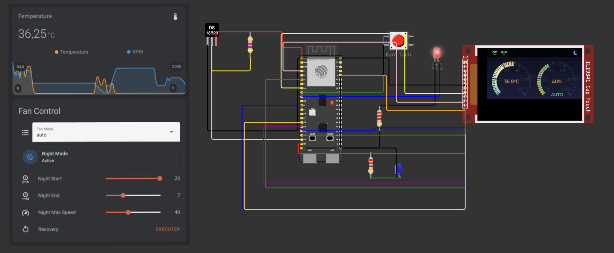

# ESP32 Fan Controller

A fan controller system built with ESP32, featuring temperature-based control, MQTT integration, persistent configuration, and a TFT display interface. (including a wokwi simulation)

[](./assets/wokwi-screenshot.png)

## Key Features

- **Temperature Control**

  - Automatic fan speed adjustment based on temperature readings
  - DS18B20 temperature sensor integration
  - Configurable temperature thresholds and response curves
  - Temperature smoothing for stable operation

- **Fan Management**

  - PWM-based speed control with RPM monitoring
  - Automatic and manual operation modes
  - Stall detection and automatic recovery
  - Configurable minimum and maximum speed limits
  - RPM feedback monitoring
  - Persistent configuration of operating mode and settings

- **Night Mode**

  - Configurable quiet hours operation
  - Automatic time-based activation with NTP sync
  - Adjustable maximum speed during night hours
  - Manual override capability
  - Persistent night mode settings between restarts

- **Configuration Persistence**

  - Fan operation mode (Auto/Manual)
  - Manual speed settings
  - Night mode state and settings
  - Settings preserved across power cycles
  - ESP32's Non-Volatile Storage (NVS) based

- **Display Interface**

  - Real-time temperature and fan speed visualization
  - Status indicators for WiFi, MQTT, and night mode
  - Boot screen with initialization progress
  - Customizable dashboard layout
  - Support for both ILI9341 and LilyGO S3 displays

- **Network Connectivity**
  - WiFi connection with automatic reconnection
  - MQTT integration for remote monitoring and control
  - NTP synchronization for accurate timekeeping

## Hardware Support

### Compatible Displays

- ILI9341 TFT Display (320x240)
- LilyGO S3 Display (320x170)

### Required Components

- ESP32-S3 DevKitC-1 or compatible board
- DS18B20 Temperature Sensor
- 4-wire PWM Fan with tachometer
- Power supply appropriate for fan
- Pull-up resistors for temperature sensor and fan tachometer

## Software Dependencies

- **Framework**

  - Arduino Framework for ESP32
  - FreeRTOS

- **Core Libraries**

  - LVGL (v8.x) for UI
  - OneWire & DallasTemperature for sensor
  - PubSubClient for MQTT
  - ArduinoJson for data handling

- **Display Drivers**
  - Adafruit GFX Library
  - Adafruit ILI9341
  - ESP LCD (for LilyGO S3)

## Configuration

The system is highly configurable through the `config.h` file. Here are some key examples of available settings (see `config.h` for complete configuration options):

### Example Temperature Settings

```cpp
// See config.h for complete temperature sensor configuration
#define TEMP_MIN_TEMP    25.0  // Minimum temperature for fan activation
#define TEMP_MAX_TEMP    45.0  // Temperature for maximum fan speed
#define TEMP_SMOOTH_SAMPLES 10  // Number of samples for temperature smoothing
```

### Example Fan Settings

```cpp
// See config.h for complete fan configuration
#define FAN_MIN_SPEED    10    // Minimum fan speed (%)
#define FAN_MAX_SPEED    100   // Maximum fan speed (%)
#define FAN_MIN_PWM      26    // Minimum PWM value
#define FAN_MAX_PWM      255   // Maximum PWM value
```

### Example Night Mode Settings

```cpp
// See config.h for complete night mode configuration
#define NIGHT_MODE_START    22  // Night mode start hour (24h format)
#define NIGHT_MODE_END      7   // Night mode end hour
#define NIGHT_MODE_MAX_SPEED 40 // Maximum speed during night mode (%)
```

For a complete list of configuration options, including debug settings, WiFi parameters, MQTT configuration, and display settings, please refer to the `config.h` file in the project root.

### MQTT Topics

#### Status Topics

- `fan_controller/status` - General system status
- `fan_controller/temperature` - Current temperature readings
- `fan_controller/available` - System availability

#### Control Topics

- `fan_controller/mode` - Fan mode control
- `fan_controller/night_mode` - Night mode control
- `fan_controller/night_settings` - Night mode configuration

## Project Structure

```
├── src/
│   ├── display/
│   │   ├── boot_screen.*      # Boot/initialization display
│   │   ├── dashboard_screen.* # Main monitoring interface
│   │   ├── display_driver.*   # Hardware abstraction
│   │   └── display_manager.*  # Display state management
│   ├── core/
│   │   ├── fan_controller.*   # Fan control logic
│   │   ├── temp_sensor.*      # Temperature monitoring
│   │   ├── task_manager.*     # FreeRTOS management
│   │   └── config_preference.* # Persistent configuration
│   ├── network/
│   │   ├── mqtt_manager.*     # MQTT communication
│   │   ├── wifi_manager.*     # WiFi connectivity
│   │   └── ntp_manager.*      # Time synchronization
│   └── config.h              # System configuration
```

## Configuration Persistence

The system maintains the following settings across power cycles:

```cpp
// Persistent Fan Settings
- Fan Operation Mode (Auto/Manual)
- Manual Speed Setting
- Night Mode State (Enabled/Disabled)
- Night Mode Start Hour
- Night Mode End Hour
- Night Mode Maximum Speed
```

These settings are automatically saved when changed and restored on system startup.

## Building and Installation

1. Clone the repository
2. Install PlatformIO
3. Configure settings in `config.h`
4. Build and upload:
   ```bash
   pio run -t upload
   ```

## License

This project is licensed under the MIT License. See LICENSE file for details.
